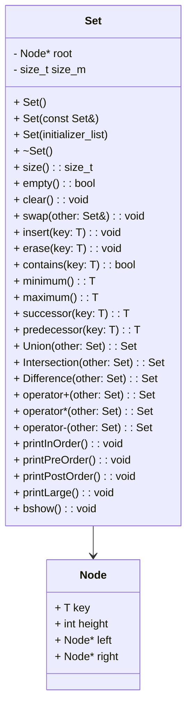

# 🚀 Conjuntos Dinâmicos AVL


<p align="center">
  
</p>


> Implementação em C++ de conjuntos dinâmicos de inteiros usando árvores AVL, garantindo operações de inserção, remoção e busca com complexidade O(log n).

## 📑 Sumário

- [Sobre](#sobre)
- [Funcionalidades](#funcionalidades)
- [UML & Arquitetura](#uml--arquitetura)
- [Demonstração](#demonstração)
- [Pré-requisitos](#pré-requisitos)
- [Instalação](#instalação)
- [Uso](#uso)
- [API Reference](#api-reference)
- [Roadmap](#roadmap)
- [Contribuição](#contribuição)
- [Licença](#licença)
- [Créditos](#créditos)

---

## Sobre

Este projeto apresenta uma estrutura de dados `Set` dinâmica e genérica, implementada em C++ usando uma árvore AVL para manter o balanceamento. Foi desenvolvido como parte da Avaliação Continuada 02 da disciplina de Estruturas de Dados Avançadas na Universidade Federal do Ceará.

- **Status:** 🎯 Em desenvolvimento
- **Tecnologias:** C++21, STL
- **Objetivo:** Fornecer operações de conjunto (inserção, remoção, busca, união, interseção e diferença) com complexidade de tempo O(log n) no pior caso.

---

## Funcionalidades

- **Inserção** (`insert(x)`) – adiciona um inteiro ao conjunto, mantendo a árvore balanceada.
- **Remoção** (`erase(x)`) – remove um inteiro se presente, rebalanceando a árvore.
- **Busca** (`contains(x)`) – verifica se um inteiro faz parte do conjunto.
- **Limpar** (`clear()`) – esvazia o conjunto.
- **Troca** (`swap(T)`) – troca o conteúdo de dois conjuntos em O(1).
- **Mínimo/Máximo** (`minimum()`, `maximum()`) – busca o menor e maior elemento, lançando exceção se vazio.
- **Sucessor/Predecessor** (`successor(x)`, `predecessor(x)`) – encontra vizinhos no conjunto ou lança exceção.
- **Empty/Size** (`empty()`, `size()`) – verifica se vazio e retorna o número de elementos.
- **Operações binárias:**
  - **União** (`Union(S, R)`) – retorna S ∪ R.
  - **Interseção** (`Intersection(S, R)`) – retorna S ∩ R.
  - **Diferença** (`Difference(S, R)`) – retorna S − R.

---

## UML & Arquitetura


A arquitetura segue o paradigma orientado a objetos, utilizando classes e métodos para encapsular a lógica de manipulação de conjuntos. A classe `Set` é responsável por gerenciar a árvore AVL, enquanto a classe `Node` representa os nós da árvore.

---

## Demonstração

A aplicação possui um menu interativo que permite ao usuário realizar operações de conjuntos dinâmicos. Abaixo estão algumas capturas de tela e um vídeo demonstrando o funcionamento da aplicação.

-- **Menu Interativo:**
  - O usuário pode escolher entre criar, manipular ou imprimir conjuntos, além de realizar operações como união, interseção e diferença.


-- **Exemplo de uso:**
  - Demonstração de impressão de conjuntos em diferentes ordens (in-order, pre-order, post-order, etc).


-- **Vídeo de Demonstração:**
  - Um vídeo curto mostrando a aplicação em funcionamento, incluindo a criação de conjuntos, inserção e remoção de elementos, e operações de união e interseção.


---

## Pré-requisitos

- **Compilador:** g++ com suporte C++17 ou superior
- **Ferramenta de build:** make
- **Sistema operacional:** Windows, macOS ou Linux

---

## Instalação

### Clonando o repositório
```bash
git clone https://github.com/WillianSilva51/Conjuntos-Dinamicos-AVL.git
cd Conjuntos-Dinamicos-AVL
```

### Usando Make
```bash
# Instale o make se não estiver disponível
cd Conjuntos-Dinamicos-AVL
make
```

---

## Uso

Execute o binário e siga o menu para testar as operações:

```bash
cd Conjuntos-Dinamicos-AVL/bin
./Conjuntos-Dinamicos-AVL
```

Exemplo de fluxo:
``` bash
Escolha uma opção:
1) Criar conjunto
2) Manipular conjunto
3) Imprimir conjunto
4) Trocar conjuntos
5) União de conjuntos
6) Interseção de conjuntos
7) Diferença de conjuntos
8) Sair
```

---

## API Reference

| Método                    | Descrição                                         |
|---------------------------|---------------------------------------------------|
| `Set()`                   | Construtor: cria conjunto vazio                   |
| `~Set()`                  | Destrutor: libera memória                         |
| `insert(x)`               | Insere inteiro x                                  |
| `erase(x)`                | Remove inteiro x                                  |
| `contains(x)`             | Retorna true se x pertence                        |
| `clear()`                 | Esvazia conjunto                                  |
| `swap(T)`                 | Troca conteúdo de dois conjuntos                  |
| `minimum()` / `maximum()` | Retorna menor/maior elemento ou lança exceção     |
| `successor(x)`            | Retorna sucessor de x ou lança exceção            |
| `predecessor(x)`          | Retorna antecessor de x ou lança exceção          |
| `empty()`                 | Retorna true se vazio                             |
| `size()`                  | Retorna número de elementos                       |
| `union(S, R)`             | Retorna união de S e R                            |
| `intersection(S, R)`      | Retorna interseção de S e R                       |
| `difference(S, R)`        | Retorna diferença de S e R                        |

---

## Roadmap

- [x] Operações básicas de conjunto
- [x] Balanceamento AVL nas inserções e remoções
- [x] Operações binárias (união, interseção, diferença)
- [x] Versão genérica (templates C++)
- [x] Testes unitários
- [ ] Documentação detalhada

---

## Contribuição

1. Fork deste repositório
2. Crie uma branch: `git checkout -b feature/nome-da-feature`
3. Commit: `git commit -m 'Descrição da mudança'`
4. Push: `git push origin feature/nome-da-feature`
5. Abra um Pull Request

Como alternativa, consulte a documentação do GitHub em [como criar uma solicitação pull](https://help.github.com/en/github/collaborating-with-issues-and-pull-requests/creating-a-pull-request).

---

## Licença

Este projeto está licenciado sob a licença MIT. Veja o arquivo [LICENSE](LICENSE) para detalhes.

---

## Créditos

- Prof. Átilio Gomes Luiz – Universidade Federal do Ceará
- Material de apoio da disciplina de EDA Avançada
- [AVL Trees - Wikipedia](https://pt.wikipedia.org/wiki/AVL_tree)
- [C++ Reference](https://en.cppreference.com/w/)
- [C++ STL Documentation](https://en.cppreference.com/w/cpp)
