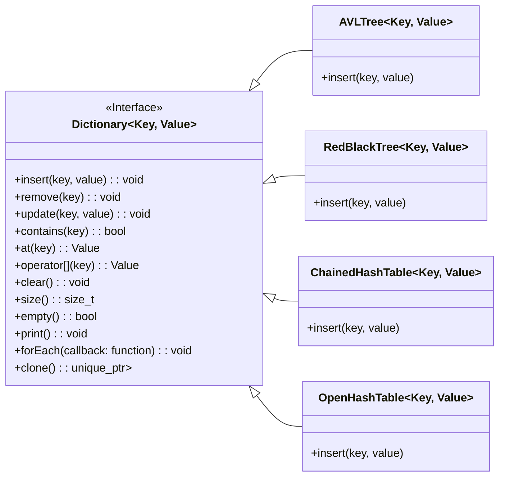

# 📊 Contador de Frequências com Estruturas de Dados Avançadas

<p align="center">
  
</p>

> Implementação e análise comparativa em C++ de múltiplas estruturas de dados (Árvore AVL, Árvore Rubro-Negra, Tabela Hash com Encadeamento e com Endereçamento Aberto) aplicadas a um problema de contagem de frequência de palavras.

## 📑 Sumário

  - [Sobre o Projeto](#sobre-o-projeto)
  - [Estruturas e Funcionalidades](#estruturas-e-funcionalidades)
  - [Métricas Coletadas](#métricas-coletadas)
  - [Arquitetura e UML](#arquitetura-e-uml)
  - [Pré-requisitos](#pré-requisitos)
  - [Instalação e Compilação](#instalação-e-compilação)
  - [Executando os Testes](#executando-os-testes)
  - [Documentação da API](#documentação-da-api)
  - [Roadmap do Projeto](#roadmap-do-projeto)
  - [Contribuição](#contribuição)
  - [Licença](#licença)
  - [Créditos](#créditos)

-----

## Sobre o Projeto

Este repositório contém a **Parte 1** do projeto da disciplina de Estruturas de Dados Avançadas (QXD0115) da Universidade Federal do Ceará. O objetivo final do projeto é desenvolver um contador de frequência de palavras a partir de um arquivo de texto e, mais importante, analisar e comparar a performance de diferentes estruturas de dados subjacentes.

Nesta primeira fase, o foco está na implementação robusta e genérica das seguintes estruturas de dados, que servem como "dicionários" (mapas de chave-valor):

  * **Árvore AVL**
  * **Árvore Rubro-Negra**
  * **Tabela Hash com Encadeamento Separado**
  * **Tabela Hash com Endereçamento Aberto (Sondagem Linear)**

Cada estrutura foi instrumentada com contadores para coletar métricas de desempenho, permitindo uma análise empírica de suas operações.

  - **Status:** 🎯 **Parte 1 Concluída**
  - **Tecnologias:** C++21, STL, GoogleTest
  - **Objetivo da Parte 1:** Fornecer implementações corretas, genéricas e testadas das estruturas de dados, capazes de coletar métricas de performance para análise futura.

-----

## Estruturas e Funcionalidades

O projeto define uma interface de dicionário (`Dictionary<Key, Value>`) com as seguintes operações essenciais, garantindo que a aplicação final possa alternar entre as diferentes implementações de forma transparente.

  * `insert(key, value)` – Adiciona um par chave-valor ao dicionário.

  * `remove(key)` – Remove um par com base na chave.
  
  * `at(key)` – Busca um valor associado a uma chave.
  
  * `contains(key)` – Verifica se uma chave está presente.
  
  * `clear()` – Remove todos os elementos do dicionário.
  
  * `empty()` – Verifica se o dicionário está vazio.
  
  * `size()` – Retorna o número de elementos.
  
  * `update(key, value)` – Atualiza o valor associado a uma chave existente.
  
  * `operator[](key)` – Permite acesso direto ao valor associado a uma chave, similar ao operador de índice em mapas.
  
  * `print()` – Imprime todos os pares chave-valor no dicionário.
  
  * `forEach(callback)` – Executa uma função de callback para cada par chave-valor.
  
  * `clone()` – Cria uma cópia profunda do dicionário, útil para operações que requerem duplicação de dados.

-----

### Métricas Coletadas

Um requisito central desta fase é a análise de performance. Para isso, as seguintes métricas são rastreadas dentro de cada estrutura:

| Estrutura | Métricas |
| :--- | :--- |
| **Árvores (AVL e Rubro-Negra)** | `comparações`, `rotações` (simples e duplas) |
| **Tabelas Hash** | `comparações`, `colisões` |

Estes dados são cruciais para a análise comparativa que será realizada na segunda parte do projeto.

-----

## Arquitetura e UML

A arquitetura foi projetada para ser extensível e modular. Uma classe base abstrata `Dictionary` define o contrato para todas as implementações concretas, e uma `DictionaryFactory` facilita a criação de diferentes tipos de dicionários.



-----

## Pré-requisitos

Para compilar e executar este projeto, você precisará de:

  - **Sistema Operacional:** Linux ou subsistema WSL no Windows, Windows e Mac.
  - **Compilador C++:** `g++` com suporte a C++21.
  - **Ferramentas de Build:** `make` e `git`.

A biblioteca `googletest` é utilizada para os testes e já está incluída como um submódulo no repositório.

-----

## Instalação e Compilação

Siga os passos abaixo para obter o código e compilá-lo.

1.  **Clone o repositório:**

    ```bash
    git clone https://github.com/WillianSilva51/Dictionary.git
    cd Dictionary
    ```

2.  **Inicialize o submódulo do GoogleTest:**

    ```bash
    git submodule update --init --recursive
    ```

3.  **Compile o projeto usando o Makefile:**
    O `makefile` principal oferece vários alvos. Para a Parte 1, os mais relevantes são `all` (para compilar tudo) e `test` (para executar os testes).

    ```bash
    # Compila o programa principal e os testes
    make all
    ```

-----

## Executando os Testes

A validação das estruturas de dados, foco da Parte 1, é realizada através de um conjunto de testes unitários. Para executá-los, use o seguinte comando:

```bash
make test
```

A saída mostrará os resultados de todos os testes para cada estrutura de dados, garantindo que as operações básicas e os casos extremos estão funcionando como esperado.

-----

## Documentação da API

A documentação completa de todas as classes, métodos e da arquitetura do projeto foi gerada automaticamente com o **Doxygen**. Para consultá-la:

1.  **Gere a documentação (se ainda não o fez):**

    ```bash
    make docs
    ```

2.  **Abra o arquivo principal em seu navegador:**
    `docs/html/index.html`

A documentação é a melhor fonte de referência para entender os detalhes de implementação de cada método.

-----

## Roadmap do Projeto

  - [x] **Parte 1:** Implementação das Estruturas de Dados (AVL, RB, Hash com Encadeamento, Hash com Endereçamento Aberto).
  - [x] **Parte 1:** Inclusão de contadores de métricas de performance (comparações, rotações, colisões).
  - [x] **Parte 1:** Desenvolvimento de testes unitários com GoogleTest para validar as estruturas.
  - [x] **Parte 1:** Criação da documentação da API com Doxygen.
  - [ ] **Parte 2:** Implementação da aplicação de contador de frequência (leitura de arquivos, processamento de texto).
  - [ ] **Parte 2:** Coleta de dados e análise comparativa de performance entre as estruturas.
  - [ ] **Parte 2:** Finalização do relatório e apresentação do projeto.

-----

## Contribuição

Contribuições são bem-vindas\! Se você tiver sugestões para melhorar o projeto, siga estes passos:

1.  Faça um *Fork* deste repositório.
2.  Crie uma nova *Branch*: `git checkout -b feature/sua-feature`.
3.  Faça o *Commit* de suas mudanças: `git commit -m 'feat: Descrição da sua feature'`.
4.  Faça o *Push* para a *Branch*: `git push origin feature/sua-feature`.
5.  Abra um *Pull Request*.

Como alternativa, consulte a documentação do GitHub em [como criar uma solicitação pull](https://help.github.com/en/github/collaborating-with-issues-and-pull-requests/creating-a-pull-request).

-----

## Licença

Este projeto está licenciado sob a Licença MIT. Veja o arquivo [LICENSE](LICENSE.md) para mais detalhes.

-----

## Créditos

  * **Professor:** [Átilio Gomes Luiz](https://www.google.com/search?q=https://github.com/atiliogomes) – Universidade Federal do Ceará.
  * **Material de Apoio:** Slides e materiais da disciplina de Estruturas de Dados Avançadas.
  * **Ferramentas:** [GoogleTest](https://github.com/google/googletest) para os testes unitários.