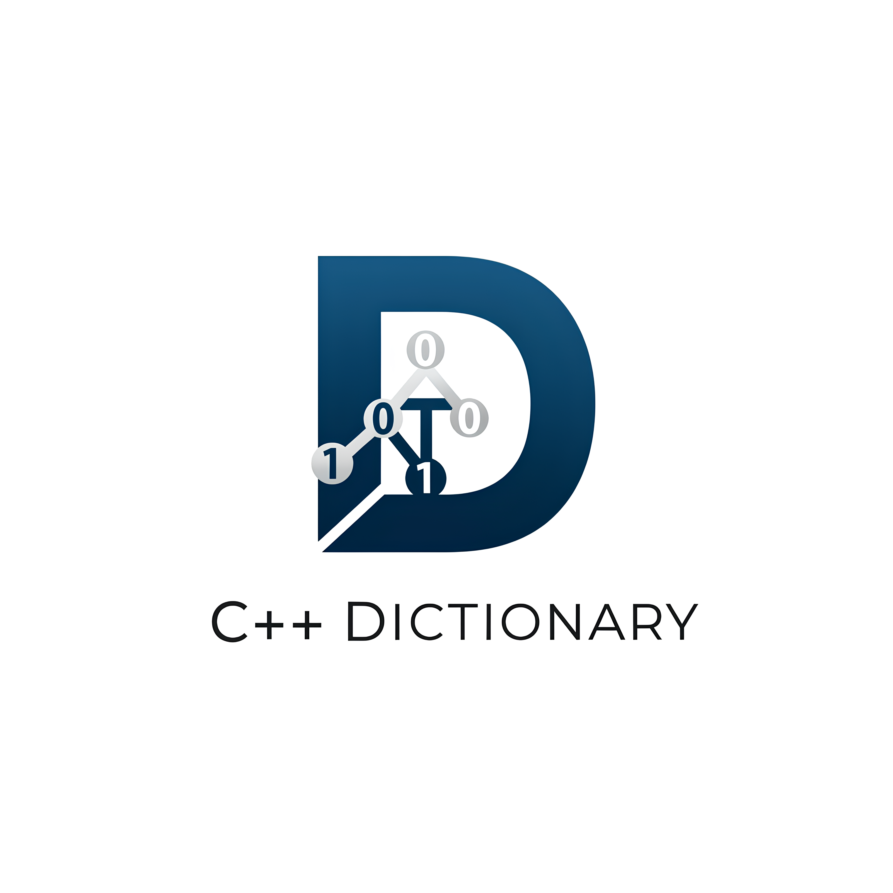
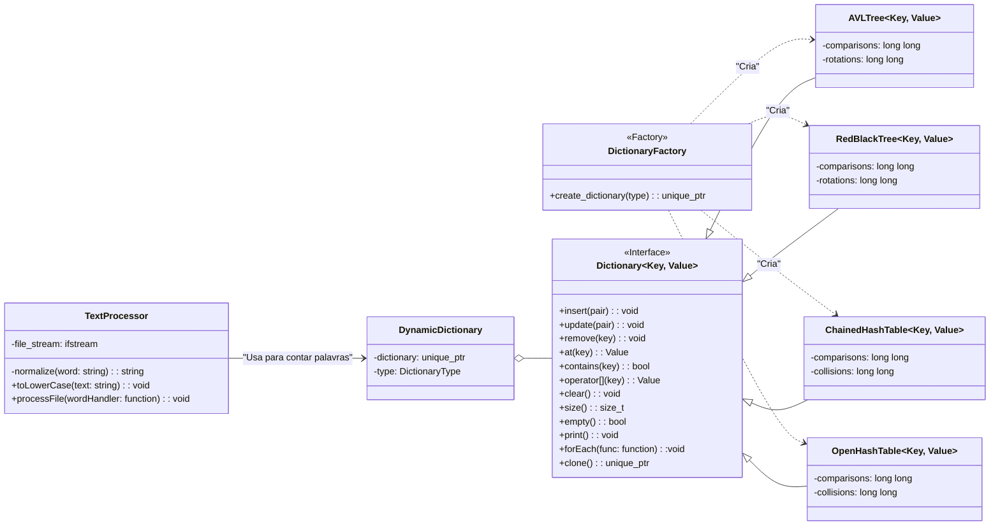
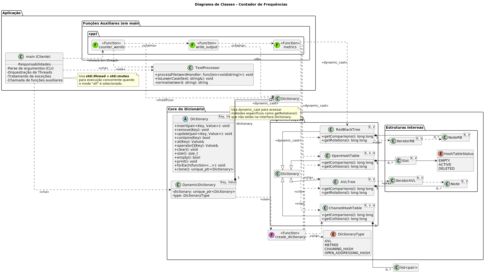

# 📊 Contador de Frequências com Estruturas de Dados Avançadas


  

<p align="center">

<p/>
  
> Aplicação em C++ para contagem de frequência de palavras em textos, utilizando e comparando o desempenho de quatro diferentes estruturas de dados: Árvore AVL, Árvore Rubro-Negra, Tabela Hash com Encadeamento e Tabela Hash com Endereçamento Aberto.

## 📑 Sumário

  - [Sobre o Projeto](#sobre-o-projeto)
  - [Estruturas e Funcionalidades](#estruturas-e-funcionalidades)
  - [Métricas Coletadas](#métricas-coletadas)
  - [Arquitetura e UML](#arquitetura-e-uml)
  - [Pré-requisitos](#pré-requisitos)
  - [Instalação e Compilação](#instalação-e-compilação)
  - [Executando o Programa](#executando-o-programa)
  - [Usando com Docker](#usando-com-docker)
  - [Executando os Testes](#executando-os-testes)
  - [Documentação da API](#documentação-da-api)
  - [Roadmap do Projeto](#roadmap-do-projeto)
  - [Contribuição](#contribuição)
  - [Licença](#licença)
  - [Créditos](#créditos)

-----

## Sobre o Projeto

Este repositório contém um projeto completo para a disciplina de Estruturas de Dados Avançadas (QXD0115) da Universidade Federal do Ceará. O objetivo é duplo:

1.  **Implementar Estruturas de Dados:** Desenvolver implementações genéricas, robustas e eficientes de dicionários (mapas chave-valor) usando Árvore AVL, Árvore Rubro-Negra, Tabela Hash com Encadeamento e Tabela Hash com Endereçamento Aberto.
2.  **Analisar Performance:** Utilizar essas estruturas em uma aplicação prática de contagem de frequência de palavras para coletar métricas (comparações, rotações, colisões) e realizar uma análise empírica do desempenho de cada uma em um cenário real.

O projeto é dividido em duas partes principais, conforme a especificação:

  * **Parte 1:** Foco na implementação e teste das estruturas de dados.
  * **Parte 2:** Desenvolvimento da aplicação final (contador de frequência) e análise comparativa.

<!-- end list -->

  - **Status:** 🚀 **Aplicação Finalizada e Pronta para Análise**
  - **Tecnologias:** C++20, STL, GoogleTest, Doxygen, Make
  - **Objetivo Final:** Fornecer uma ferramenta funcional para análise de texto e, mais importante, um estudo comparativo sobre a performance de estruturas de dados clássicas.

-----

## Estruturas e Funcionalidades

O núcleo do projeto é uma interface de dicionário (`Dictionary<Key, Value>`) que abstrai a implementação subjacente, permitindo que a aplicação principal troque a estrutura de dados dinamicamente.

### Interface `Dictionary`

A interface `Dictionary.hpp` define o seguinte contrato para todas as estruturas:

  - `insert(const std::pair<Key, Value>&)`: Adiciona um par chave-valor.
  - `remove(const Key&)`: Remove um par com base na chave.
  - `update(const std::pair<Key, Value>&)`: Atualiza o valor de uma chave existente.
  - `contains(const Key&)`: Verifica a existência de uma chave.
  - `at(const Key&)`: Busca e retorna uma referência ao valor associado a uma chave.
  - `operator[](const Key&)`: Permite acesso ou inserção de um valor (similar ao `std::map`).
  - `clear()`: Remove todos os elementos.
  - `size()`: Retorna o número de elementos.
  - `empty()`: Verifica se o dicionário está vazio.
  - `print()`: Imprime o conteúdo do dicionário.
  - `forEach(const std::function<...>&)`: Executa uma função para cada par chave-valor.
  - `clone()`: Cria uma cópia profunda (deep copy) do dicionário.

### Componentes da Aplicação

Além das estruturas de dados, a aplicação conta com os seguintes componentes principais:

  - **`DynamicDictionary`**: Uma classe *wrapper* que permite selecionar e usar qualquer uma das implementações de dicionário em tempo de execução.
  - **`DictionaryFactory`**: Uma fábrica que simplifica a criação de instâncias de dicionários (`AVLTree`, `RedBlackTree`, etc.) com base em um `DictionaryType`.
  - **`TextProcessor`**: Classe responsável por ler um arquivo de texto, normalizar as palavras (convertendo para minúsculas e removendo pontuações) e alimentar o dicionário.

-----

### Métricas Coletadas

Um requisito central do projeto é a análise de performance. Para isso, as seguintes métricas são rastreadas dentro de cada estrutura:

| Estrutura | Métricas |
| :--- | :--- |
| **Árvores (AVL e Rubro-Negra)** | `comparações`, `rotações` |
| **Tabelas Hash** | `comparações`, `colisões` |

Esses dados, juntamente com o tempo de execução, são salvos em arquivos de saída para permitir a análise comparativa.

-----

## Arquitetura e UML

A arquitetura foi projetada para ser modular e extensível. O diagrama abaixo ilustra a relação entre os principais componentes do sistema:


Este diagrama UML mostra a relação entre as classes principais do projeto, destacando a interface `Dictionary` e suas implementações concretas. A classe `TextProcessor` é responsável por processar o texto e alimentar o dicionário, enquanto a `DictionaryFactory` facilita a criação das diferentes estruturas de dados.

---
Diagrama geral do projeto:



-----

## Pré-requisitos

Para compilar e executar este projeto, você precisará de:
  - **Compilador C++:** `g++` com suporte a C++20 ou superior.
  - **Ferramentas de Build:** `make` e `git`.
  - **Documentação:** `Doxygen` (opcional, para gerar a documentação da API).

A biblioteca `googletest` é utilizada para os testes e já está incluída como um submódulo no repositório.

-----

## Instalação e Compilação

Siga os passos abaixo para obter o código e compilá-lo.

1.  **Clone o repositório:**

    ```bash
    git clone https://github.com/WillianSilva51/Dictionary.git
    cd Dictionary
    ```

2.  **Inicialize o submódulo do GoogleTest:**

    ```bash
    git submodule update --init --recursive
    ```

3.  **Compile o projeto usando o Makefile:**
    O `makefile` principal oferece vários alvos. Para compilar a aplicação principal e os testes, use `all`.

    ```bash
    # Compila o programa principal
    make
    ```

    Para compilar em modo *release* (otimizado), use:

    ```bash
    make MODE=release
    ```

-----

## Executando o Programa

Após a compilação, você pode executar o contador de frequência a partir da raiz do projeto. O programa espera dois argumentos: o tipo de estrutura de dados e o nome do arquivo de texto (que deve estar no diretório `files/`).

**Sintaxe:**

```bash
./build/bin/Dictionary <estrutura> <arquivo.txt>
```

**Argumentos:**

  * `<estrutura>`: O tipo de dicionário a ser usado. Opções:
      * `avl`: Árvore AVL
      * `rbt`: Árvore Rubro-Negra
      * `chash`: Tabela Hash com Encadeamento
      * `ohash`: Tabela Hash com Endereçamento Aberto
      * `all`: Executa e compara todas as quatro estruturas em threads separadas.
  * `<arquivo.txt>`: O nome do arquivo de texto localizado na pasta `files/`.

**Exemplos:**

```bash
# Executar com a Árvore Rubro-Negra no arquivo bible.txt
./build/bin/Dictionary rbt bible.txt

# Executar e comparar todas as estruturas no arquivo donquijote.txt
./build/bin/Dictionary all donquijote.txt
```

Os resultados, incluindo a contagem de palavras e as métricas de desempenho, serão salvos em um novo arquivo dentro do diretório `out/`. O programa também exibirá um resumo das métricas no console.

Para ver a mensagem de ajuda, execute:

```bash
./build/bin/Dictionary help
```

## Usando com Docker

Você também pode executar a aplicação usando o Docker, o que simplifica a configuração do ambiente. A imagem oficial está disponível no Docker Hub. Caso não tenha o Docker instalado, siga as instruções em [Get Docker](https://docs.docker.com/get-docker).

### Executando a partir do Docker Hub

Esta é a maneira mais fácil de começar. 

1.  **Puxe a imagem do Docker Hub:**

    ```bash
    docker pull williansilva51/dictionary
    ```

2.  **Execute o contêiner:**
    Por padrão, o comando `./freq.sh all domcasmurro.txt` será executado.

    ```bash
    docker run williansilva51/dictionary
    ```

    Você pode passar outros argumentos, como faria normalmente na linha de comando, para usar outras estruturas e arquivos:

    ```bash
    docker run williansilva51/dictionary <estrutura> <arquivo.txt>
    ```

### Usando arquivos de entrada e saída com volumes

Você pode usar arquivos `.txt` do seu computador e salvar a saída em uma pasta local, sem precisar alterar a imagem. Basta montar dois volumes:

* **Entrada**: pasta contendo os arquivos `.txt` que você quer analisar
* **Saída**: pasta onde os resultados serão gravados

#### ▶️ Comando para rodar com esses arquivos:

```bash
docker run --rm \
  -v "$(pwd)/entrada:/app/files" \
  -v "$(pwd)/out:/app/out" \
  williansilva51/dictionary all domcasmurro.txt
```

> Esse comando executa a estrutura `all` sobre o arquivo `domcasmurro.txt`, e o resultado será salvo em um arquivo dentro da pasta `./out/`. O nome do arquivo de saída pode variar conforme o nome do arquivo de entrada.

### Construindo a Imagem Localmente (Opcional)

Se preferir construir a imagem a partir do código-fonte:

1.  **Construa a imagem do Docker:**
    ```bash
    docker build -t dictionary .
    ```
2.  **Execute o contêiner:**
    ```bash
    docker run dictionary
    ```

### Executando a partir do Docker Compose

Você também pode usar o Docker Compose para simplificar a execução da aplicação. Use o arquivo `docker-compose.yml` que está na raiz do projeto.

Para iniciar a aplicação, execute:

```bash
docker compose up
```

-----

## Executando os Testes

A validação das estruturas de dados é realizada através de um conjunto de testes unitários com GoogleTest. Para executá-los, use o seguinte comando:

```bash
make test
```

A saída mostrará os resultados de todos os casos de teste para cada estrutura de dados, garantindo que as operações básicas e os casos de borda estão funcionando como esperado.

-----

## Documentação da API

A documentação completa de todas as classes, métodos e da arquitetura do projeto foi gerada com o **Doxygen**. Para consultá-la:

1.  **Gere a documentação (requer Doxygen instalado):**

    ```bash
    make docs
    ```

2.  **Abra o arquivo principal em seu navegador:**
    `docs/html/index.html`

A documentação é a melhor fonte de referência para entender os detalhes de implementação de cada método.

-----

## Roadmap do Projeto

  - [x] **Parte 1:** Implementação das Estruturas de Dados (AVL, RB, Hash com Encadeamento, Hash com Endereçamento Aberto).
  - [x] **Parte 1:** Inclusão de contadores de métricas de performance (comparações, rotações, colisões).
  - [x] **Parte 1:** Desenvolvimento de testes unitários com GoogleTest para validar as estruturas.
  - [x] **Parte 1:** Criação da documentação da API com Doxygen.
  - [x] **Parte 2:** Implementação da aplicação de contador de frequência (leitura de arquivos, processamento de texto).
  - [x] **Parte 2:** Coleta de dados e análise comparativa de performance entre as estruturas.
  - [x] **Parte 2:** Finalização do relatório e apresentação do projeto.

-----

## Contribuição

Contribuições são bem-vindas\! Se você tiver sugestões para melhorar o projeto, siga estes passos:

1.  Faça um *Fork* deste repositório.
2.  Crie uma nova *Branch*: `git checkout -b feature/sua-feature`.
3.  Faça o *Commit* de suas mudanças: `git commit -m 'feat: Descrição da sua feature'`.
4.  Faça o *Push* para a *Branch*: `git push origin feature/sua-feature`.
5.  Abra um *Pull Request*.

Como alternativa, consulte a documentação do GitHub em [como criar uma solicitação pull](https://help.github.com/en/github/collaborating-with-issues-and-pull-requests/creating-a-pull-request).

-----

## Licença

Este projeto está licenciado sob a Licença MIT. Veja o arquivo `LICENSE` para mais detalhes.

-----

## Créditos

  - **Professor:** Prof. Atílio Gomes Luiz – Universidade Federal do Ceará.
  - **Material de Apoio:** Slides e materiais da disciplina de Estruturas de Dados Avançadas.
  - **Ferramentas:** [GoogleTest](https://github.com/google/googletest) para os testes unitários e [Doxygen](https://www.doxygen.nl/) para a documentação.
